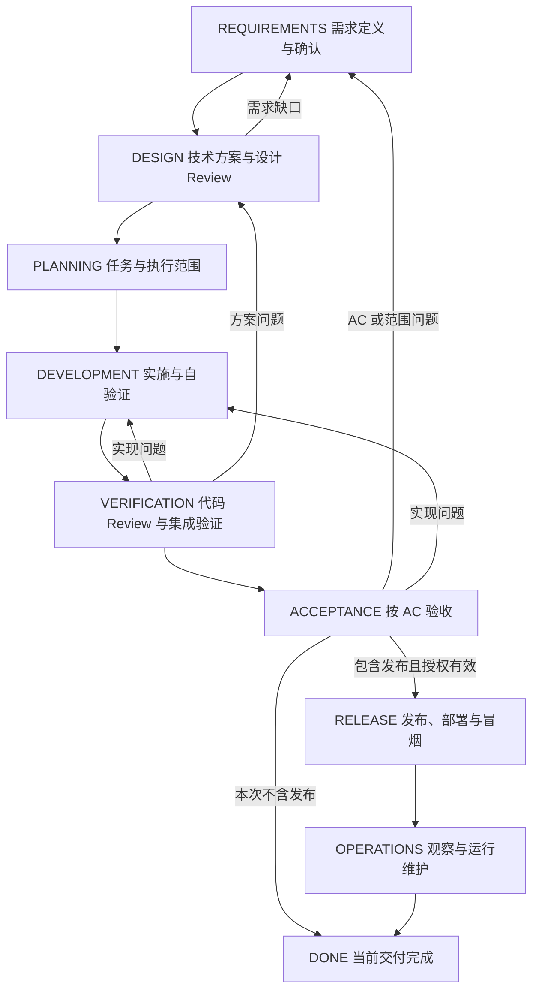

# 流程与门禁

阶段描述当前交付。运行状态另行表达 ACTIVE、WAITING_APPROVAL、BLOCKED、PAUSED、RECOVERING、DONE；例如 DEVELOPMENT / RECOVERING 是开发位置上的恢复核对，不是一个新的需求阶段。旧项目已有等价名称时可保留并说明对应关系。

任务自验证 → 代码 Review → 相关任务集成 → AC 验收是结果依赖，不要求无关任务全部完成才开始验证。可以提前做探索性集成检查，但不能用它跳过自验证或宣称交付已通过。

## 阶段退出条件

| 阶段 | 当前资料与结果 | 退出门禁 |
|---|---|---|
| REQUIREMENTS | 目标、范围、约束、业务规则、AC、需求 Review | 用户确认或既有明确授权覆盖目标与范围；AC 可观察，关键歧义已解决 |
| DESIGN | 实现边界、接口或数据变化、异常策略、验证策略、设计 Review | AC 有实现与验证映射；关键方案在已确认范围内，无阻止实施的设计缺口 |
| PLANNING | 稳定任务 ID、目标、依赖、范围、适用验证与完成条件 | 可执行、可验证；执行范围明确，必要前置已具备 |
| DEVELOPMENT | 代码或必要可执行产物、当前进展与自验证 | 当前任务适用的编译、静态或场景检查通过；未完成与未执行明确保留 |
| VERIFICATION | 代码 Review、相关模块或接口集成证据 | 阻止完成的问题已处理；证据覆盖当前实现，相关依赖核对一致 |
| ACCEPTANCE | AC 对照、实际结果、开发者或约定验收机制的结论 | 本次范围全部 AC 有有效依据；未满足项处理或明确调整后重新确认 |
| RELEASE | 发布范围、环境、构建物、执行与恢复方案 | 验收有效，发布与相关外部操作授权明确；发布后冒烟通过 |
| OPERATIONS | 约定观察结果、当前运行说明、问题分流 | 满足本次观察与移交条件；遗留事项有归属，不能凭未观察宣称稳定 |

不包含发布的交付在验收后结束；不因模板有 RELEASE 就强行部署。无需数据库、复杂图或独立接口契约的项目，不生成这些文件。

## 确认与 Review 的依据

用户已明确授权范围内自主设计和实施时，该授权可以覆盖内部设计审查和常规任务编排；记录覆盖范围，不重复逐阶段询问。需求讨论、方案建议和只读 Review 请求保持其原范围。

结论就地记录：对象与修订 / 代码范围、检查方式、执行者、结果、剩余条件、依据位置。Agent 自检标为自检，不冒充开发者确认、独立审查或实际测试。团队要求独立 Review 时按其要求安排；没有独立 Review 不虚构第三方通过结论。

通过结论只对覆盖的版本和范围有效。需求、设计、接口或实现变化后先评估影响；受影响门禁标为待复核，再更新证据。正常缺陷修复不必重跑无关需求阶段；业务目标变化不能只修改代码。

发现“多实例是否去重”等缺口时，先判断业务边界是否已确认。边界不明回需求核对，边界明确但实现不足回设计；不能把技术推测直接添加为新的已确认 AC。

阻塞只标在实际无法推进的范围上，说明缺什么、谁能解除、解除后做什么。等待必要决定时为 WAITING_APPROVAL；恢复核对仍可进行时保持 RECOVERING。暂停来自用户指令或已核实项目事实，不由空闲时间推定。

任务状态可用 TODO、READY、IN_PROGRESS、VERIFYING、REVIEWING、BLOCKED、DONE；遵循项目已有等价状态。DONE 要满足该任务约定完成条件，不等于已经发布。待审查任务不能计为已完成；被取消任务明确记录，不假装完成。

辅助详细流程图：[development-flow.drawio](../assets/development-flow.drawio)。图帮助理解原始流程，具体范围、确认与门禁以本文件为准。
